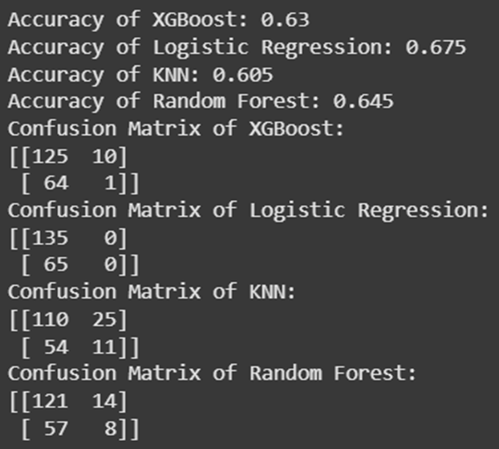
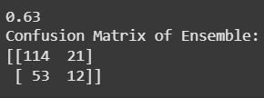

# Predict failure risk

**Các links liên quan đến model**

- Train model: [https://colab.research.google.com/drive/1gDsbo7bdXd4g8EezQTmYDwRMcZNiC8nA?usp=drive_link](url)
- Dư liệu dùng để train: [https://www.kaggle.com/datasets/mujtabamatin/dataset-for-machine-failure-detection](url)

**Kỹ thuật dự đoán**

- Ensemble learning: đây là kỹ thuật dựa trên tính toán các kết quả dự đoán của nhiều model nhỏ và đưa ra quyết định cuối cùng
- Các mô hình nhỏ trong hội đồng đưa ra quyết định gồm:
  - XGBoost: mô hình ổn định nhưng khả năng xác định nguy cơ thấp
  - Logistic Regression: mô hình có khả năng xác định trạng thái 'normal' tốt nhưng lại không thể xác định nguy cơ hư hại
  - KNN: mô hình có khả năng xác định nguy cơ hư hại tốt nhất trong 4 mô hình nhưng khả năng xác định trạng thái 'normal' kém
  - Random forest: mô hình ổn định nhưng khả năng xác định các trạng thái chưa tối ưu
- Cách chọn trọng số cho 4 mô hình trên:
  - Sức ảnh hưởng cao nhất: Random forest - do mô hình có khả năng phân biệt cả 2 loại trạng thái hiệu quả
  - Sức ảnh hưởng cao nhì: KNN - mô hình cũng có khả năng phân biệt 2 loại trạng thái nhưng chưa hiệu quả đối với 'normal'
  - Sức ảnh hưởng cao ba: XGBoost - mô hình cũng có khả năng phân biệt 2 loại trạng thái nhưng chưa hiệu quả đối với nguy cơ hư hại
  - Sức ảnh hưởng thấp nhất: Logistic Regression - mô hình gần như không thể phân biệt được 2 loại trạng thái

**Kết quả phân tích**

- Kết quả đánh giá các mô hình con
  
  
- Kết quả đánh giá mô hình chính
  
  
